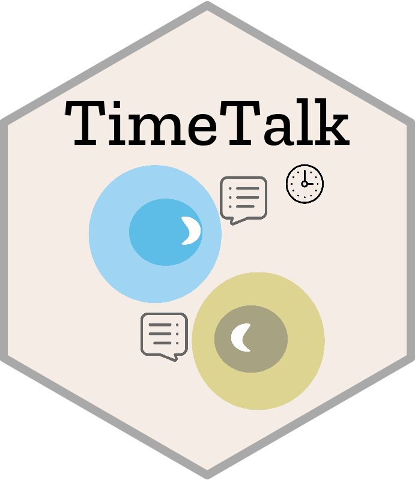

## TimeTalk 

<p href="https://github.com/ChengLiLab/TimeTalk"></p>

**TimeTalk** An R package to perform cell-cell communication studies by utilizing temporal information behind single-cell sequencing, which is suitable for development biology research. In brief, TimeTalk uses the temporal information unraveled by trajectory analysis and the Granger causal test to test the ligand-receptor pairs with causal relationships to master transcription factors during development. Therefore it can elucidate the potential causal relationship between ligand-receptor interaction and TF activity.

## The workflow 

<p align="center">
  
</p>


## installation

devtools::install_github("ChengLiLab/TimeTalk",ref="master")

## How to run TimeTalk?

### Step 1, build celltype specific TRN of each cell type

```
### build all the CellType specific TRN, not run it will take too long time
lapply(levels(seu), function(ii){
  rtna <- myGetCellTypeSpecificTRN(tmp.seu = seu,
                                   tmp.ident = ii,
                                   gene.TF = gene.TF,
                                   tmp.phenotype = tmp.phenotype)
  saveRDS(rtna,file = myFileName(prefix = paste0("res/R/",ii,"RTN_rtna_object"),suffix = ".rds"))
})
### not run again!!!
tmp.all.de.RNA <- FindAllMarkers(object = seu,
                                 assay = "RNA",
                                 only.pos = T)
####read result
tmp.res.list <- lapply(levels(seu),FUN = function(ii){
  cat(ii,sep = "\n")
  tmp.ident <- ii
  tmp.files <- list.files(path = "res/R",pattern = paste0(tmp.ident,"RTN_rtna_object"))
  rtna <- readRDS(file = paste0("res/R/",tmp.files))
  mra <- tna.get(rtna, what="mra", ntop = -1)
  tmp.gene.use <- tmp.all.de.RNA %>%
    filter(cluster == tmp.ident) %>%
    filter(p_val_adj < 0.05) %>%
    pull(gene)
  mra.res <- mra %>%
    filter(Pvalue < 0.05) %>%
    filter(Regulon %in% tmp.gene.use) %>%
    mutate(group = tmp.ident)
  return(mra.res)
})
tmp.mra.res <- Reduce(rbind,tmp.res.list)
saveRDS(object = tmp.mra.res,file = "res/R/B_blastoid_RTN_mra_result.rds")

```

### Step two: Run TimeTalk
```
tmp.mra.res <- readRDS(file = "res/R/B_blastoid_RTN_mra_result.rds")
LRpairs.df <- read.delim(file = "database/Ligand-Receptor-Pairs/Mouse/Mouse-2020-Shao-LR-pairs.txt",stringsAsFactors = F)
TimeTalk.result <- RunTimeTalk(tmp.cds=tmp.cds,
             tmp.seu=tmp.seu,
             tmp.ident.1="EPI",
             tmp.ident.2 = "PE",
             LRpairs.df = LRpairs.df,
             tmp.mra.res = tmp.mra.res,tmp.winsz = 0.1,
             numPts = 200,
             tmp.SCC.cutoff = 0.2,
             tmp.granger.cutoff = 1e-2)
```
### Recomendation

According to our simulation results, the Granger causality conclusion is affected by choice of parameter winsz. Thus,  we acknowledge the need for additional methods to validate the inferred potential regulatory relationship between ligand-receptor interactions and transcription factors. Regrettably, the scarcity of high temporal resolution datasets hinders our ability to address this issue. Despite this limitation, we have acknowledged in the Discussion section of the manuscript that our causal analysis serves as a helpful reference, and we intend to improve our approach in the future with more accurate data. Furthermore, we advise users to conduct additional data analysis and experiment with various parameter combinations to achieve more dependable results when utilizing TimeTalk for cell communication analysis.

### To do

make the readme file more clear...

### log 

+ update log and fix function bugs: 2023.05.02.

+ update the documentation file: 2023.06.01.

### cication

TimeTalk: Deciphering cell-cell communication during early embryo development using single-cell RNA-seq datasets (manuscript under revision)
